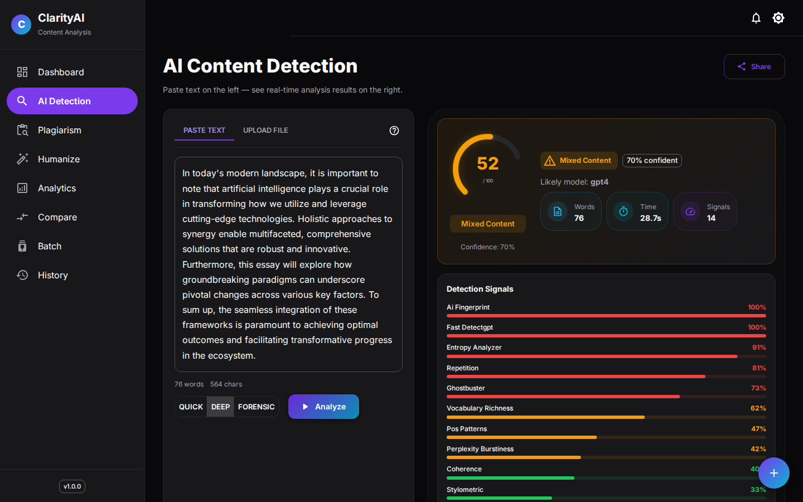
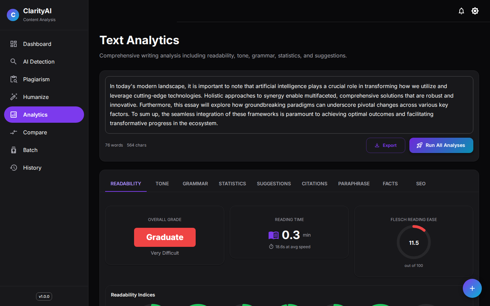
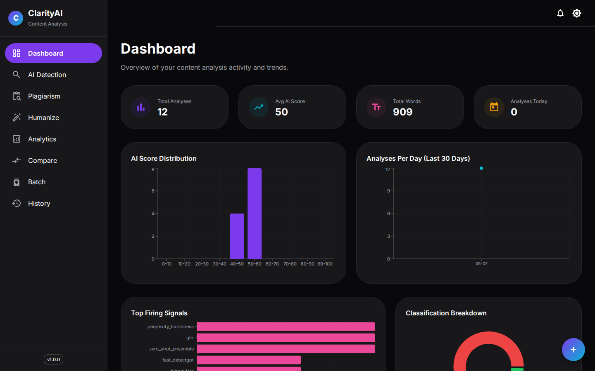
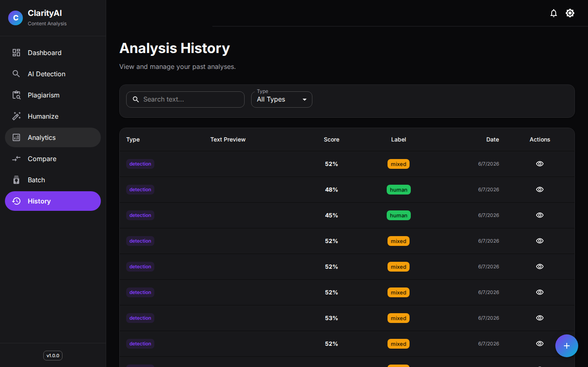

<div align="center">

# ClarityAI

**An 18-signal AI-text detection platform with plagiarism checking, humanization and writing analytics — every verdict explained, signal by signal.**

[](https://github.com/Gauthambinoy20/clarity-ai/actions/workflows/ci.yml)
[](https://github.com/Gauthambinoy20/clarity-ai/actions/workflows/security.yml)
[](https://github.com/Gauthambinoy20/clarity-ai/actions/workflows/codeql.yml)
[](https://github.com/Gauthambinoy20/clarity-ai/actions/workflows/deploy.yml)


[](LICENSE)

</div>

## What it does

Paste a piece of text and ClarityAI tells you how machine-written it looks — not as a single mystery number, but as fourteen independent detection signals (perplexity, GLTR token ranks, stylometry, model fingerprints, watermarks and more) combined by a stacked ensemble, with a per-sentence heatmap showing *where* the AI-flavoured passages are. Ask *"is this cover letter AI?"* → get a calibrated score, the signal breakdown that produced it, and which model family it most resembles.

Around that core: plagiarism checking (exact n-grams + semantic embeddings + live source discovery), a humanizer that rewrites flagged text, and a writing-analytics suite (readability, tone, grammar, SEO, citations, statistics).

> AI detection is probabilistic. Scores are editorial signals, not proof of authorship — expect false positives and negatives on short, heavily edited, or non-native text.

**Live demo:** arriving with the AWS deployment — the infrastructure is written and validated in [`infra/`](infra/), one `terraform apply` away.

**Cost:** runs 100% free locally (all models are open weights, downloaded once and cached; the optional Ollama rewrite stage is local too). The AWS target is a single small EC2 instance.

## Hero



## Quick start

**Docker (recommended)** — the whole product in one command:

```bash
git clone https://github.com/Gauthambinoy20/clarity-ai.git
cd clarity-ai
docker compose up --build
# UI:  http://localhost:5173
# API: http://localhost:8000/api/v1/docs
```

First detection downloads the models (a few GB) into the container cache; everything after is fast.

**Local development:**

```bash
# backend
cd backend
python3 -m venv .venv && source .venv/bin/activate
pip install -r requirements.txt -r requirements-dev.txt
python -m spacy download en_core_web_sm
python -c "import nltk; [nltk.download(p) for p in ['punkt','punkt_tab','averaged_perceptron_tagger','stopwords']]"
uvicorn app.main:app --reload

# frontend
cd frontend
npm ci
npm run dev
```

**Tests and quality gates** (exactly what CI runs):

```bash
# backend: 741 tests, coverage gated at 70%
cd backend && pytest tests/ --cov=app --cov-fail-under=70
ruff check app/ --select E,F,W --ignore E501 && black --check app/ tests/
mypy app/ --ignore-missing-imports && bandit -r app/ -q

# frontend: 110 tests incl. accessibility
cd frontend && npx vitest run
npx eslint src --max-warnings 0 && npx prettier --check src && npx tsc --noEmit
```

## CI/CD pipeline

Five workflows, all required green:

| Workflow | Gates |
|---|---|
| **CI** | ruff · black · mypy · bandit · pip-audit · pytest (cov ≥ 70%) · eslint (0 warnings) · prettier · tsc · vitest · npm audit (prod, high+) · production build |
| **Security** | gitleaks over full history · Trivy filesystem scan (fails on fixable CRITICAL/HIGH) |
| **CodeQL** | SAST on Python and TypeScript, weekly + every push |
| **Deploy** | builds both images to GHCR with layer caching; rolls the EC2 stack over SSH and smoke-tests the live URL (inert until host secrets are set) |
| **Dependabot** | weekly: pip, npm, GitHub Actions, Terraform |

## Features

- **Deep detection** — 14 signals in parallel: perplexity/burstiness, GLTR, Fast-DetectGPT, Binoculars, Ghostbuster, zero-shot classifier ensemble, entropy, stylometry, POS patterns, vocabulary richness, repetition, coherence, statistical watermarks, model fingerprints
- **Fast mode** — the three strongest signals sharing one cached GPT-2, for interactive latency
- **Explainability** — per-sentence heatmap, GLTR token colouring, signal radar, model-family attribution
- **Plagiarism** — exact n-gram fingerprinting, semantic embedding match, live source discovery across six engines
- **Humanizer** — lexical/structural/targeted rewriting with an optional local Ollama stage, scored before vs after
- **Analytics** — readability indices, tone, grammar, SEO, citations, paraphrase detection, side-by-side comparison, writing coach
- **Workflow** — batch processing with live progress, history, dashboard with trends, PDF/JSON/CSV export, share links, realtime as-you-type detection over websocket
- **Accessible UI** — all eight pages axe-clean, dark/light theme, responsive, keyboard shortcuts

## Architecture

Two services: a React 18 + MUI SPA served by nginx (which proxies `/api` and `/ws`), and a FastAPI backend owning the ML pipeline, SQLite persistence and the websocket. Models load lazily through a registry pinned to exact Hugging Face revisions.

~50 REST endpoints across nine routers (`detection`, `analytics`, `dashboard`, `plagiarism`, `humanization`, `export`, `advanced`, `realtime`, `health`) plus `ws/detect`. Interactive docs at `/api/v1/docs`.

Nine Mermaid diagrams — system, data flow, request lifecycles, ER, module map, state machine, trust boundaries, deployment — live in [`docs/ARCHITECTURE.md`](docs/ARCHITECTURE.md).

## Screenshots

All captured from the production build running the real models — nothing staged.

| | |
|---|---|
|  |  |
| *Deep detection: score, classification, 14-signal breakdown* | *Analytics suite on a real run* |
|  |  |
| *Dashboard: real aggregates and trends* | *History: every analysis stored and filterable* |

## Approach & decisions

- **Ensemble over single-model**: each detector returns `{signal, ai_probability, confidence, evidence}`; a stacked meta-learner weighs signals by reliability, with a hard override when a statistical watermark is found. A name-bridge translates detector outputs onto the feature vector the meta-learner was built around.
- **Calibration is measured, not assumed**: GLTR's score mapping is centred on a labelled probe set (human prose lands at 0.58–0.65 top-10 token ratio under GPT-2, LLM prose at 0.70–0.79); the measured ratios are pinned as unit tests.
- **Fail soft, never fake**: a detector that can't load its model degrades to a flagged neutral result; an empty detector roster is a loud 503. The test suite enforces both.
- **Supply chain**: every model download is pinned to an exact hub revision; external XML goes through defusedxml; bandit and pip-audit gate CI.
- Deeper write-ups in [`docs/ARCHITECTURE.md`](docs/ARCHITECTURE.md).

## Productionizing & scaling

✍️ TODO: my words

## Key technical decisions & why

✍️ TODO: my words

## Engineering standards I followed (and skipped)

✍️ TODO: my words

## How I used AI tools in development

✍️ TODO: my words

## What I'd do differently with more time

✍️ TODO: my words

## Edge cases knowingly skipped

✍️ TODO: my words

## License

MIT © 2026 Gautham Binoy — see [LICENSE](LICENSE).

## About

AI content analysis platform — FastAPI, React, NLP ensemble detection, Docker, Terraform/AWS.
`ai-detection` · `nlp` · `fastapi` · `react` · `typescript` · `machine-learning` · `plagiarism-detection` · `text-analytics` · `docker` · `terraform`
