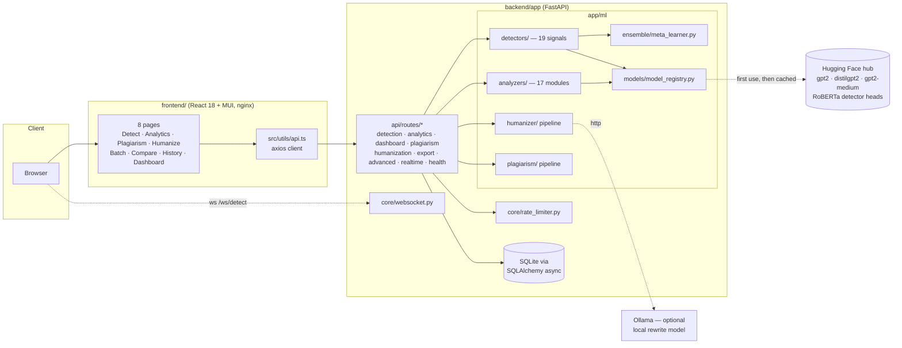
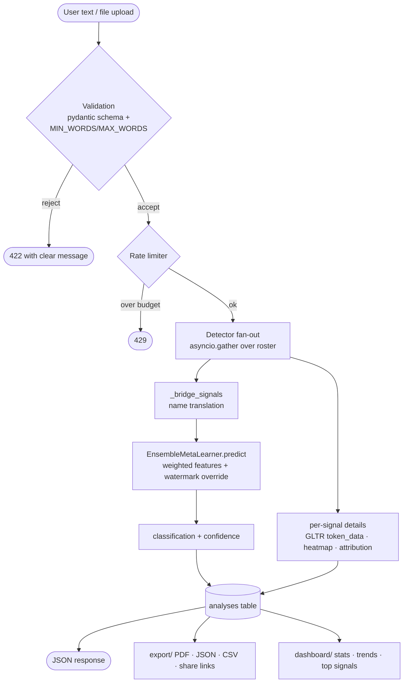
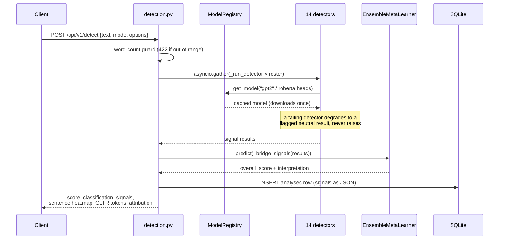
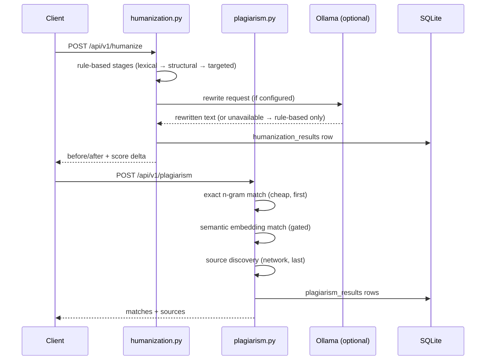
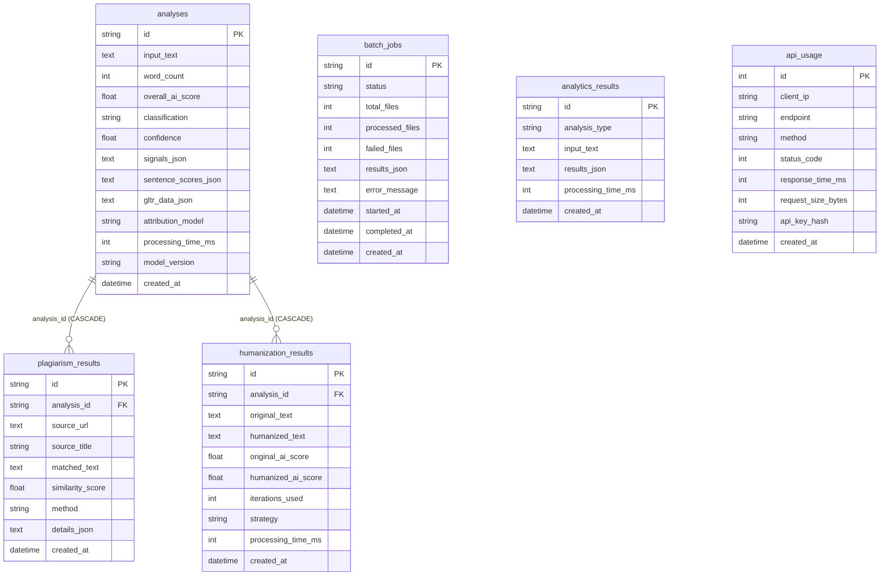
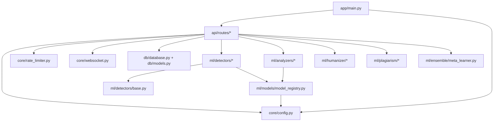
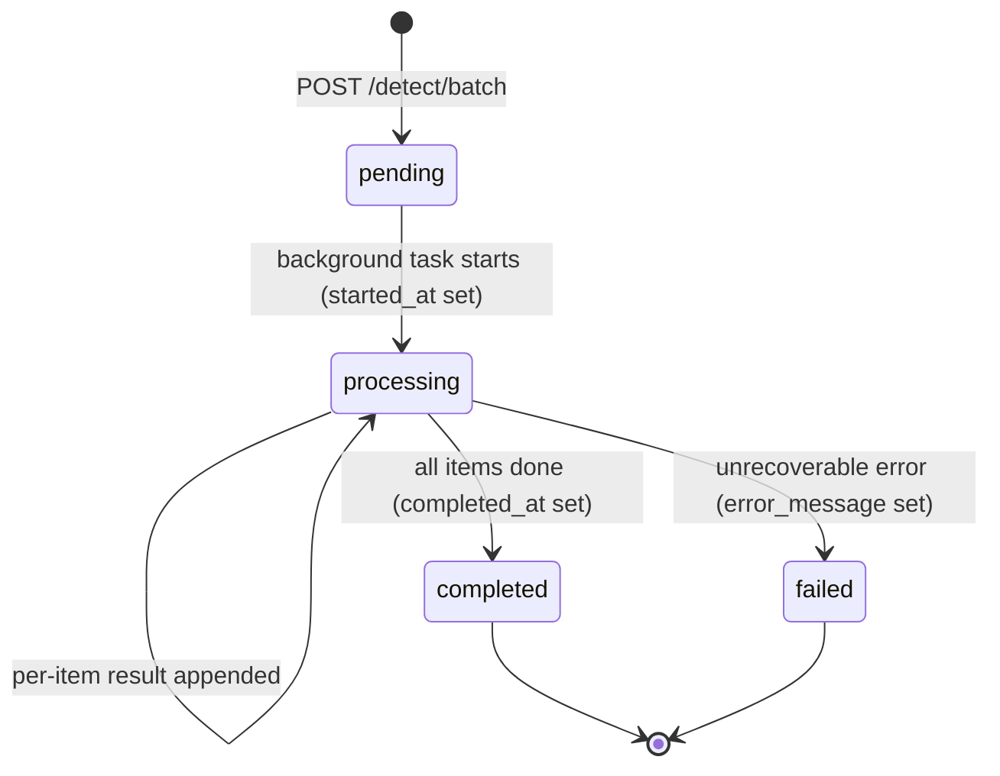
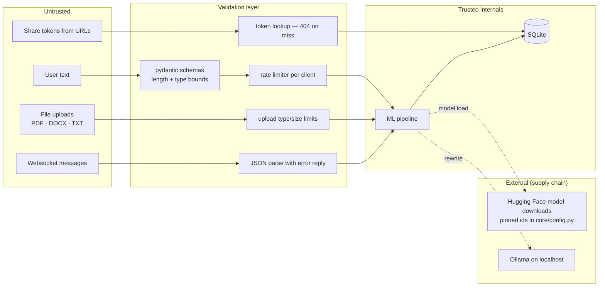

# ClarityAI Architecture

How the system fits together, derived from the code in this repository.
Each diagram names real modules, routes and tables — if it's in a box here,
you can find it in the tree.

ClarityAI reports probabilistic writing signals. It is designed for portfolio
demonstration, editorial triage, and NLP experimentation, not definitive
authorship attribution.

## 1. System architecture

All components and how they connect. The frontend is a static React build
served by nginx; the backend is a single FastAPI service that owns the ML
pipeline, the database and the websocket.

## 2. Data flow (DFD)

Where a piece of user text travels, from input to stored result.

## 3. Sequence — the /detect request lifecycle

The core path of the product, as implemented in
`api/routes/detection.py::_run_full_detection`.

## 4. Sequence — humanize and plagiarism (compact)

## 5. Entity-relationship

Six tables; JSON payloads live in TEXT columns because SQLite has no native
JSON type.

## 6. Module map (backend)

Internal dependency direction — routes orchestrate, ml computes, core and db
support. Nothing in `ml/` imports from `api/`.

## 7. State machine — batch jobs

From `db/models.py::BatchJob` and the batch path in
`api/routes/detection.py`.

## 8. Trust boundaries

Where untrusted input is validated and what the service trusts.

> The deployment/infrastructure diagram is added alongside the Terraform
> code in `infra/` so it documents what is actually provisioned.
